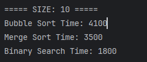
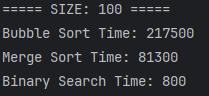
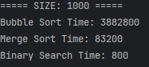

Sorting & Searching Algorithms – Assignment 3
       What this project is about

In this assignment I worked with three classic algorithms

Bubble Sort
Merge Sort
Binary Search

The main goal was not just to implement them, but to compare how they actually perform with different data sizes and understand why some algorithms are faster than others.

----------------------------------------------------------

 What I did

I created a small system with three classes:

Sorter – handles sorting (Bubble and Merge)
Searcher – handles searching (Binary Search)
Experiment – runs tests and measures execution time

I tested everything on arrays of different sizes:

- small (10 elements)
- medium (100 elements)
- large (1000 elements)

----------------------------------------------------------
Results

Here are the results I got:

Size	Bubble Sort	  Merge Sort	   Binary Search
10  	4100	       3500	              1800
100  	217500	       81300	           800
1000	3882800	       83200	           800

The difference between algorithms becomes really obvious with bigger arrays.

Bubble Sort is fine for small data, but becomes very slow as size grows
Merge Sort is much more stable and efficient
Binary Search is extremely fast and almost doesn’t change with size
----------------------------------------------------------
to analyze

Which sorting algorithm is faster?
Merge Sort is clearly faster, especially for large arrays. This is because it uses a divide-and-conquer approach and has better time complexity.

How does size affect performance?
The larger the array, the worse Bubble Sort performs. Merge Sort handles large data much better.

Sorted vs unsorted data
Bubble Sort can be faster if the array is already sorted (because of early stopping), while Merge Sort behaves almost the same in both cases.

Does it match theory (Big-O)?
Yes. The results match what we expect:

Bubble Sort → O(n²)
Merge Sort → O(n log n)
Binary Search → O(log n)

Why is Binary Search so fast?
Because it cuts the search space in half every step.

Why must the array be sorted?
Without sorting, Binary Search wouldn’t know which half to continue searching in.
----------------------------------------------------------
 Reflection

This assignment helped me understand the real difference between algorithms, not just in theory but in practice. Before this, Bubble Sort didn’t seem that bad, but when I tested it on larger arrays, it became clear how inefficient it is.

I also had some challenges with project setup (packages, classes, etc.), but fixing those helped me better understand how Java projects are structured.

Overall, this task made me more confident in working with algorithms and analyzing their performance.

----------------------------------------------------------

----------------------------------------------------------

📂 Project Structure
src/
├── Main.java
├── Sorter.java
├── Searcher.java
└── Experiment.java